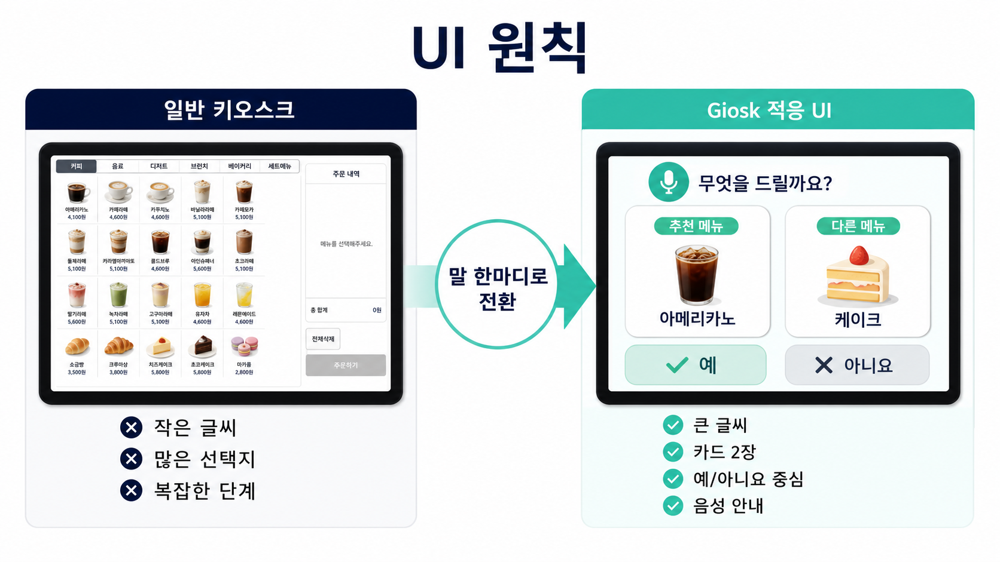
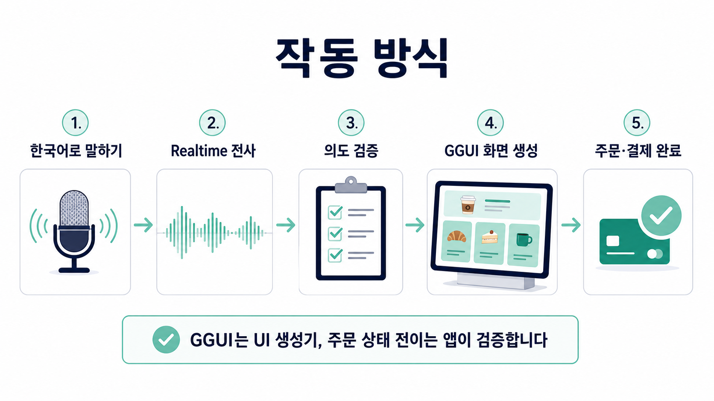
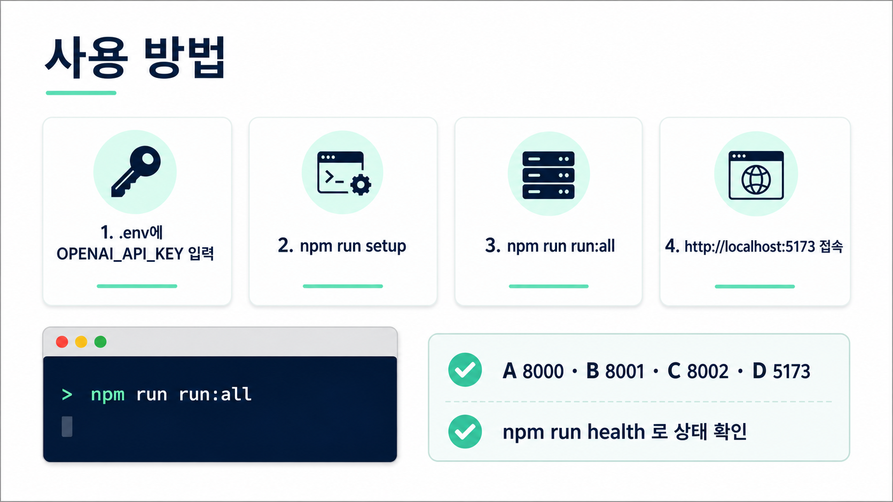

# Giosk

말하면 나에게 맞는 화면이 뜨는 음성 키오스크입니다. 한국어로 주문하면 OpenAI Realtime이 발화를 듣고, 앱이 주문 의도를 검증한 뒤, GGUI가 큰 글씨와 큰 카드 중심의 적응형 화면을 생성합니다.


## 핵심 아이디어

기존 키오스크는 모든 사용자에게 같은 화면을 보여줍니다. 작은 글씨, 많은 선택지, 복잡한 단계는 익숙하지 않은 사용자에게 주문 포기나 직원 호출로 이어집니다.

Giosk는 사용자가 별도 모드를 찾지 않아도 말 한마디로 주문 흐름을 시작합니다. 화면 구조는 큰 글씨, 큰 카드, 예/아니요 중심으로 단순하게 유지하고, 발화에 맞춰 추천 메뉴, 옵션, 포장 여부, 적립, 결제 확인 화면을 순서대로 바꿉니다.



## 작동 방식



```text
브라우저 마이크
  -> OpenAI Realtime WebRTC 대화
  -> Module D 주문 오케스트레이터
  -> Module C /ground-intent 의도 검증
  -> Module C /generate-ui GGUI 화면 생성
  -> Module B /orders mock 결제
```

GGUI는 UI 생성기 역할에 집중합니다. 메뉴 후보, 옵션, 주문 단계 전이는 앱과 백엔드 계약에서 먼저 검증한 뒤 GGUI에 넘깁니다. 이 구조 덕분에 GGUI가 메뉴 DB에 없는 항목을 임의로 만들거나 주문 상태를 건너뛰는 일을 줄입니다.

## 사용 방법



```bash
cp .env.example .env
# .env 파일의 OPENAI_API_KEY= 뒤에 본인 OpenAI API 키 입력

npm run setup
npm run run:all
open http://localhost:5173
```

브라우저에서 마이크 권한을 허용한 뒤 음성 주문 버튼을 누르고 한국어로 말하면 됩니다.

예시 발화:

- `따뜻한 라떼 하나 주세요`
- `안 단 걸로 해주세요`
- `아이스로 크게 주세요`
- `포장할게요`
- `카카오페이로 결제할게요`
- `네`

## 주요 명령

| 명령 | 설명 |
|---|---|
| `npm run setup` | 내부 app 루트와 B/C/D Node 의존성 설치, Module A Python venv 구성 |
| `npm run run:all` | A/B/C/D와 GGUI 서버를 한 번에 기동 |
| `npm run health` | A/B/C/D 헬스체크 |
| `npm run prewarm:ggui` | GGUI 화면 6개를 미리 생성해 첫 렌더 지연을 줄임 |
| `npm run verify` | 루트 구조 테스트, Module C 테스트, Module D typecheck/build, Module A 테스트 |
| `npm run stop` | 8000/8001/8002/5173/6781 포트 정리 |

## 내부 구성

사용자는 repo 루트에서 `npm run ...` 명령만 쓰면 됩니다. 아래 A/B/C/D는 하나의 Giosk 프로젝트 안에서 동시에 뜨는 내부 서비스 경계입니다.

| 모듈 | 역할 | 스택 | 포트 |
|---|---|---|---|
| Module A | OpenAI Realtime ephemeral 세션 토큰 발급 | Python, FastAPI | 8000 |
| Module B | 메뉴 제공, 주문 생성, mock 결제 | Node, Express | 8001 |
| Module C | 의도 검증, GGUI 적응 UI 생성, LOCAL 폴백 | Node, Express, GGUI MCP | 8002 |
| Module D | 웹 키오스크 프론트, 음성 대화, 주문 상태기계 | React, Vite | 5173 |
| GGUI | C가 호출하는 UI 생성 서버 | `@ggui-ai/cli` | 6781 |
| contracts | 4개 모듈 공유 데이터 계약 | TypeScript, Python schema | - |

## API 요약

### Module A

| 메서드 | 경로 | 설명 |
|---|---|---|
| `GET` | `/health` | 상태 확인 |
| `POST` | `/realtime/session` | 브라우저 WebRTC 연결용 OpenAI Realtime client secret 발급 |

Module A는 오디오 업로드 STT를 제공하지 않습니다. 브라우저가 ephemeral token으로 OpenAI Realtime에 직접 연결합니다.

### Module B

| 메서드 | 경로 | 설명 |
|---|---|---|
| `GET` | `/menu` | 전체 메뉴 |
| `GET` | `/menu/search?q=latte` | 이름, 설명, 카테고리 검색 |
| `POST` | `/orders` | 주문 생성, mock 결제 후 `status:"paid"` 반환 |
| `GET` | `/orders/:id` | 주문 조회 |
| `GET` | `/health` | 상태 확인 |

메뉴는 `voice-adaptive-kiosk/module-b/data/menu.seed.json`에서 in-memory로 로드합니다. 주문 데이터도 in-memory라 서버 재시작 시 초기화됩니다.

### Module C

| 메서드 | 경로 | 설명 |
|---|---|---|
| `POST` | `/ground-intent` | 현재 단계, 발화, 메뉴 DB, 주문 상태를 기준으로 의도와 후보를 검증 |
| `POST` | `/generate-ui` | 검증된 상태를 받아 GGUI 또는 LOCAL 렌더러로 적응 UI 생성 |
| `GET` | `/r/:id` | LOCAL 폴백 HTML 렌더 서빙 |
| `GET` | `/health` | 상태와 현재 GGUI 모드 확인 |

`X-GGUI-Path` 응답 헤더로 실제 렌더 경로를 확인할 수 있습니다. `ggui`면 GGUI 라이브 생성, `local-fallback`이면 안전 폴백입니다.

### Module D

| 단계 | 호출 |
|---|---|
| Realtime token | `POST {VITE_REALTIME_URL}/realtime/session` |
| Menu | `GET {VITE_MENU_URL}/menu` |
| Grounding | `POST {VITE_GGUI_URL}/ground-intent` |
| Adaptive UI | `POST {VITE_GGUI_URL}/generate-ui` |
| Order | `POST {VITE_MENU_URL}/orders` |

## 환경 변수

repo 루트의 `.env.example`을 복사해 `.env` 하나로 관리합니다. 기존 `voice-adaptive-kiosk/.env`도 하위 호환으로 읽지만, 새 설정은 repo 루트 `.env`에 둡니다.

필수:

```bash
OPENAI_API_KEY=sk-...
```

자주 보는 값:

```bash
GGUI_MODE=ggui
GGUI_URL=http://localhost:6781
GGUI_WRAPPER_PORT=8002
GROUND_INTENT_MODEL=gpt-4.1-mini

OPENAI_REALTIME_MODEL=gpt-realtime
OPENAI_REALTIME_TRANSCRIBE_MODEL=gpt-4o-transcribe
OPENAI_REALTIME_LANGUAGE=ko
OPENAI_REALTIME_SILENCE_MS=2000
OPENAI_REALTIME_VOICE=alloy

MENU_PORT=8001
VITE_REALTIME_URL=http://localhost:8000
VITE_MENU_URL=http://localhost:8001
VITE_GGUI_URL=http://localhost:8002
VITE_USE_MOCK=false
VITE_CONVERSATIONAL=true
VITE_PORT=5173
```

## 개별 실행

전체 기동은 `npm run run:all`을 권장합니다. 모듈을 따로 볼 때는 아래처럼 실행합니다.

```bash
# Module A
cd voice-adaptive-kiosk/module-a
python3.11 -m venv .venv
.venv/bin/python -m pip install --upgrade pip wheel
.venv/bin/python -m pip install -r requirements.txt
PYTHON=.venv/bin/python ./run_local.sh

# Module B
cd voice-adaptive-kiosk/module-b
npm install
node server.js

# Module C
cd voice-adaptive-kiosk/module-c
npm install
GGUI_MODE=local node server.js

# Module D
cd voice-adaptive-kiosk/module-d
npm install
npm run dev
```

## 검증

```bash
cd voice-adaptive-kiosk
npm run health
npm run verify

cd module-a
PYTHONPATH=. .venv/bin/python -m unittest discover -s tests -v
.venv/bin/python -m py_compile app.py tests/*.py
```

간단한 curl 확인:

```bash
curl -s http://127.0.0.1:8000/health
curl -s -X POST http://127.0.0.1:8000/realtime/session
curl -s http://127.0.0.1:8001/menu
curl -s http://127.0.0.1:8002/health
```

## 공유 계약

정본은 `voice-adaptive-kiosk/contracts/types.ts`입니다. Python 미러는 `voice-adaptive-kiosk/contracts/schemas.py`입니다.

주요 계약:

- `Menu`, `MenuItem`, `MenuOption`
- `GroundIntentRequest`, `GroundIntentResponse`
- `GenerateUIRequest`, `GenerateUIResponse`
- `OrderRequest`, `OrderResponse`

계약을 바꾸면 `types.ts`, `schemas.py`, `mocks.json`, `mocks.ts`를 함께 확인합니다.

## 문제 해결

- `.env`는 `voice-adaptive-kiosk/.env` 하나를 기준으로 둡니다. `module-d/.env`를 따로 만들지 않습니다.
- `.venv`를 다른 경로에서 옮겼다면 `.venv/bin/uvicorn`을 직접 실행하지 말고 `.venv/bin/python -m uvicorn ...` 또는 `PYTHON=.venv/bin/python ./run_local.sh`를 사용합니다.
- GGUI 콜드 생성은 느릴 수 있습니다. 첫 주문부터 빠르게 보이게 하려면 `npm run prewarm:ggui`를 먼저 실행합니다.
- GGUI가 늦거나 실패하면 Module C는 LOCAL 폴백을 반환해 데모가 멈추지 않게 합니다.
- 포트가 꼬였으면 `bash run.sh stop`으로 8000/8001/8002/5173/6781을 정리합니다.
