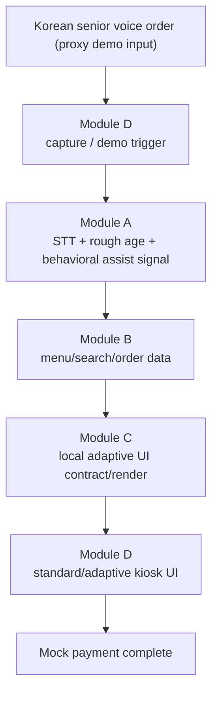

# Voice-Adaptive Kiosk Pipeline

Current pipeline is runtime-only. The old AIHub/offline training pipeline was
removed because the demo now uses a public pretrained WavLM age model.

## Module Responsibilities

- Module A: `POST /analyze`, ElevenLabs helper APIs, Korean senior proxy route.
- Module B: menu, search, order, mock payment.
- Module C: adaptive UI generation. GGUI live render (`GGUI_MODE=ggui`) is the
  intended demo goal path; currently the `ggui_push` `codeReady=false` blocker
  keeps the `GGUI_MODE=local` fallback render running live.
- Module D: kiosk UI, multi-turn order state, narration (English, `en-US`),
  payment flow.

## Removed From Runtime

- AIHub download/index/clip/split/train/export scripts.
- `models/age_model` checkpoint handoff.
- validation `artifacts/` dashboard data.
- standalone `tools/voicegen`.
