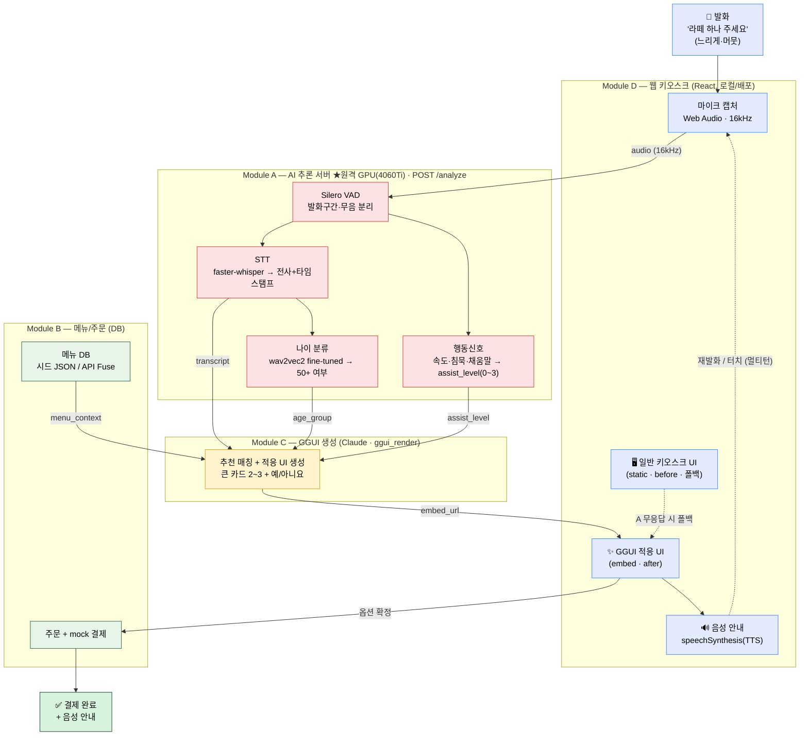
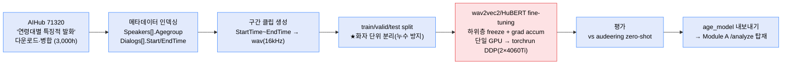
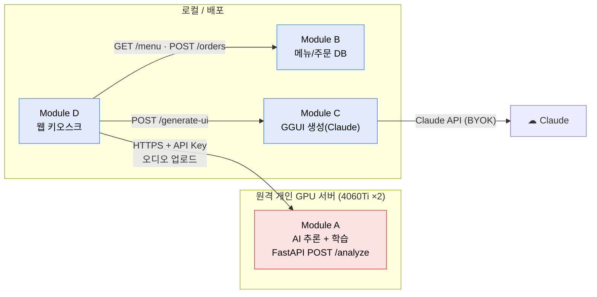

# 음성 적응형 키오스크 — 파이프라인

> OBA Weekend-thon S1 · GGUI 트랙
> 런타임(추론) 파이프라인 + 오프라인(학습) 파이프라인 2종.
> 모듈: **A** AI 추론 서버(★원격 GPU) · **B** 메뉴/주문 · **C** GGUI 생성 · **D** 웹 프론트

---

## 1. 런타임 추론 파이프라인 (발화 1회 흐름)



### 한 줄 요약
**음성 → (STT·나이·행동신호) → Claude가 추천+적응 UI 생성 → 렌더+음성안내 → 결제 완료**

### 역할
- **감지(A)**: 누가·뭐라고·어떻게 말했나 (transcript, age_group, assist_level)
- **두뇌+표현(C)**: 무엇을 추천하고 어떻게 보여줄지 (Claude가 겸임, EXAONE 없음)
- **데이터·완결(B)**: 메뉴 제공 + 주문/mock 결제
- **화면·흐름(D)**: 일반 UI ↔ GGUI 적응 UI, 마이크, 오케스트레이션

---

## 2. 오프라인 학습 파이프라인 (나이 분류 모델)



### 핵심 메모
- 라벨 = `화자연령대`. 타깃은 **"50대 이상 vs 이하" 이진**(데이터 최상단이 50+라 60+ 분리는 불가 → 타깃을 50+로 정의).
- **화자 단위 split 필수** — 같은 화자가 train/test에 섞이면 정확도 거품.
- 폴백: 학습 미완 시 **audeering zero-shot + 행동신호**로 즉시 가동(이게 스파인).

---

## 3. 모듈 경계 / 배포 위치



---

## 4. ASCII 버전 (런타임)

```
🎤 발화
  │  audio 16kHz
  ▼
┌─────────────── Module A · 원격 GPU · POST /analyze ───────────────┐
│  Silero VAD ──► STT(faster-whisper) ──► 나이분류(wav2vec2 ft)      │
│        └─────► 행동신호(속도·침묵·채움말 → assist_level)           │
└───────────────────────────────────────────────────────────────────┘
  │ transcript + age_group + assist_level
  │                          + menu (Module B: GET /menu)
  ▼
┌─────────────── Module C · GGUI 생성(Claude) · /generate-ui ───────┐
│  라떼 매칭 → 후보 2~3 추천 → 노인친화 적응 UI 생성(embed_url)      │
└───────────────────────────────────────────────────────────────────┘
  │ embed_url
  ▼
┌─────────────── Module D · 웹 키오스크 ─────────────────────────────┐
│  [일반 UI static · before/폴백]   ⇄   [GGUI 적응 UI · after]       │
│         + 🔊 음성안내(TTS)  ──재발화/터치(멀티턴)──► (다시 A)       │
└───────────────────────────────────────────────────────────────────┘
  │ 옵션 확정
  ▼
💳 mock 결제 (Module B: POST /orders) ──► ✅ 결제 완료
```

---

## 5. 노드·엣지 설명 (AI 이미지 생성 프롬프트용)

**노드(처리 단계):**
1. 🎤 사용자 발화 — 어르신이 느리고 머뭇거리며 "라떼 하나 주세요"
2. 마이크 캡처 (웹, 16kHz)
3. Silero VAD — 발화 구간/무음 분리
4. STT (faster-whisper) — 음성→텍스트 + 타임스탬프
5. 나이 분류 (wav2vec2 fine-tuned) — 50대 이상 여부
6. 행동신호 추출 — 속도·침묵·채움말 → assist_level(0~3)
7. 메뉴 DB (시드 JSON)
8. GGUI+Claude 생성 — 추천 후보 + 노인친화 적응 UI
9. 화면 렌더 — 일반 UI(before) ↔ GGUI 적응 UI(after)
10. 음성 안내 (TTS)
11. mock 결제 → ✅ 결제 완료

**엣지(데이터 흐름):**
- 2→3→(4,6): 오디오
- 4→5: 전사 텍스트
- 4,5,6→8: transcript + age_group + assist_level
- 7→8: menu_context
- 8→9: embed_url(생성된 UI)
- 9→10→(2): 멀티턴 루프(재발화/터치)
- 9→11: 옵션 확정 → 결제

**색 구분(권장):** 빨강=원격 AI(A) · 파랑=프론트(D) · 초록=DB(B) · 노랑=GGUI(C)

**레이아웃:** 위→아래 세로 흐름, 원격 GPU 박스(A)와 로컬 박스(D/B/C)를 시각적으로 분리, 멀티턴 루프는 점선 화살표.
