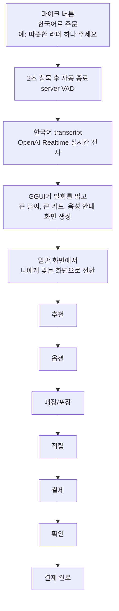

# Giosk: 말하면 나에게 맞는 화면이 뜨는 음성 키오스크

> 마이크를 누르고 **"따뜻한 라떼 하나"** 라고 말하면, 그 말을 읽어 **큰 글씨·큰 카드의 화면이 즉석에서 만들어집니다.**
> 어려운 메뉴 트리를 헤맬 필요도, '쉬운 모드'를 찾아 들어갈 필요도 없습니다. **말 한마디면 됩니다.**

OBA Weekend-thon · GGUI 트랙 · 한국어 음성 키오스크

---

## 어떤 문제를 해결하나요?

키오스크는 이제 카페·식당·병원·관공서 어디에나 있습니다. 그런데 화면은 **모두에게 똑같습니다.** 작은 글씨, 빽빽한 메뉴, 여러 단계의 터치는 익숙한 사람에겐 별것 아니지만, 그렇지 않은 사람에겐 **"내가 뒤처졌나" 하는 자책**으로 이어집니다. 실제로 많은 어르신이 키오스크 앞에서 주문을 포기하거나, 뒷사람 눈치를 보다 그냥 나가 버립니다.

대한민국은 이미 **초고령사회**에 들어섰습니다. "디지털 약자"는 일부의 문제가 아니라, **곧 우리 모두가 겪을 문제**입니다. Giosk는 화면을 사람에게 맞추는 대신 사람이 화면에 맞추는 지금의 구조를, **말 한마디로 화면이 사람에게 맞춰지는 구조**로 뒤집습니다.

## 누구를 위한 것인가요?

- **주 타깃은 50대 이상**입니다. 작은 글씨와 복잡한 단계가 가장 큰 벽이 되는 분들입니다.
- 하지만 **음성 주문은 누구에게나 편합니다.** 줄이 길 때, 손이 바쁠 때(아이를 안고 있거나 짐을 들었을 때), 처음 보는 메뉴라 무엇을 고를지 모를 때 말로 하는 게 빠릅니다.
- **매장 운영자**에게도 도움이 됩니다. "이거 어떻게 해요?" 응대 부담이 줄고, 주문 포기로 인한 이탈이 줄어듭니다.

## 핵심 기능과 작동 방식



**예시 발화가 이렇게 반영됩니다.**

- "**따뜻한 라떼** 하나" → 라떼류를 추천 카드로, 온도는 따뜻하게.
- "**안 단 걸로**" → 당도를 낮춘 선택으로.
- "**아이스로 크게**" → 온도 차갑게 + 사이즈 크게.
- "**포장**" → 포장으로. "**카카오페이**" → 카카오페이로. "**네**" → 결제 확정.

화면은 항상 **큰 글씨 + 카드 2장 + 또렷한 음성 안내**로, 인지 부담을 최소화한 구조로 고정됩니다. 바뀌는 건 *내용*뿐이고, 헷갈릴 수 있는 *구조*는 일정하게 유지됩니다.

## 기존 키오스크와 무엇이 다른가요?

| | 일반 키오스크 | **Giosk** |
|---|---|---|
| 화면 | 모두에게 **동일** | 발화를 읽어 **그 자리에서 생성** |
| 쉬운 모드 | 메뉴를 **찾아 들어가야** 함 | 그냥 **말하면** 바로 적응 화면 |
| 입력 | 터치 위주 | **음성 우선** + 터치 보조 |
| 어려운 메뉴 | 단계마다 탐색 | 말 한마디로 단계 점프 |

핵심은 **"쉬운 모드를 선택하는 것"이 아니라 "말하는 순간 화면이 맞춰지는 것"** 입니다. 적응을 위해 사용자가 따로 할 일이 없습니다.

---

## 시작하기

낯선 사람이 이 저장소만 보고 **자기 OpenAI 키로 직접 실행**할 수 있도록 설계했습니다(BYOK, Bring Your Own Key).

```bash
# 1) 클론
git clone <this-repo> && cd voice-adaptive-kiosk

# 2) OpenAI API 키 발급 → .env 에 넣기
#    https://platform.openai.com → API keys → Create new secret key
cp .env.example .env
#    편집기로 .env 를 열어 OPENAI_API_KEY= 뒤에 키를 붙여넣고 저장
#    (.env 는 .gitignore 로 보호되어 git 에 올라가지 않습니다)

# 3) 한 번에 셋업 (4개 모듈 + Python venv)
npm run setup

# 4) 전체 기동 (A·B·C·D + GGUI 자동)
npm run run:all        # = bash run.sh

# 5) (선택) GGUI 화면 미리 데우기. 첫 주문부터 즉시 GGUI 렌더
npm run prewarm:ggui

# 6) 브라우저
open http://localhost:5173
```

브라우저에서 **음성 주문** 버튼을 누르고 한국어로 주문해 보세요. 마이크 권한을 허용하면 OpenAI Realtime 음성 비서가 계속 듣고 직접 응답하며, function calling 으로 메뉴 선택부터 결제까지 화면을 넘깁니다.

## 아키텍처

4개 모듈이 함께 돕니다. 음성은 브라우저가 OpenAI 에 **직접** WebRTC 로 붙고, 백엔드는 1분짜리 임시 토큰만 발급합니다. 원본 키는 절대 브라우저로 나가지 않습니다. 화면 생성은 GGUI 가 담당합니다.

| 모듈 | 역할 | 스택 | 포트 |
|------|------|------|------|
| **A** | 음성 Realtime 세션 중계, ephemeral 세션 토큰 발급(`/realtime/session`) | Python · FastAPI · OpenAI | **8000** |
| **B** | 메뉴 제공 + 주문 + mock 결제 | Node · Express · 시드 JSON | **8001** |
| **C** | GGUI 적응 UI 생성, 발화·주문상태를 받아 화면 생성(`/generate-ui`), 한국어 의도해석(`/ground-intent`) | Node · Express · GGUI MCP | **8002** |
| **D** | 웹 키오스크 프론트, Realtime 대화형 음성 비서, function calling 주문 오케스트레이션 | React · Vite | **5173** |
| - | GGUI MCP 생성 서버, C 가 호출하고 run.sh 가 자동 기동/재사용 | `@ggui-ai/cli` | 6781 |
| - | 4모듈 공유 데이터 계약(정본) | `contracts/types.ts` · `schemas.py` · `mocks.json` | - |

```
음성 D(브라우저) ──WebRTC──► OpenAI Realtime       (A 가 임시 토큰만 발급)
        │  transcript + assistant audio + function calls
        ▼
   C(/ground-intent, /generate-ui) ──► GGUI(6781)  큰글씨·큰카드 화면 생성
        │            ▲
        │            └── B(/menu) 메뉴·옵션
        ▼
   D 가 화면 렌더 + 음성 안내 ──► B(/orders) mock 결제 ──► ✅ 완료
```

**GGUI 라이브가 메인, LOCAL 은 안전 폴백입니다.** C 가 GGUI 로 화면을 생성하면 `X-GGUI-Path: ggui` 로 확인할 수 있습니다. GGUI 가 느리거나 콜드 생성에 걸리면 내장 LOCAL 렌더러로 즉시 폴백합니다(`local-fallback`). GGUI 캐시는 화면 구조 단위라, **한 번 생성된 화면은 이후 어떤 발화에도 즉시** 뜹니다. `npm run prewarm:ggui` 로 6개 화면을 미리 데워 두면 첫 주문부터 매끄럽습니다.

### 한 번에 보는 명령

```bash
npm run setup          # 4모듈 node 의존성 + Module A Python venv
npm run run:all        # 전체 기동(= bash run.sh) + 헬스체크
npm run health         # A/B/C/D 헬스 한 번에 확인
npm run prewarm:ggui   # GGUI 6개 화면 프리워밍(라이브 즉시 렌더)
npm run verify         # Module C 테스트 + Module D typecheck/build
bash run.sh stop       # 포트(8000/8001/8002/5173/6781) 정리
```

### 기술 스택

OpenAI **Realtime API**(음성 STT, server VAD 2초 자동종료) · OpenAI **Responses API**(GGUI UI 생성 + 한국어 의도해석) · **GGUI MCP**(적응 UI 생성 엔진) · React + Vite + Pretendard(프론트) · FastAPI(Python) · Express(Node).

---

## 더 보기

- 공유 데이터 계약: [`contracts/`](./contracts) (`types.ts` 정본 + `schemas.py` 미러 + `mocks.json`)
- 모듈별 상세: 각 `module-*/README.md`
